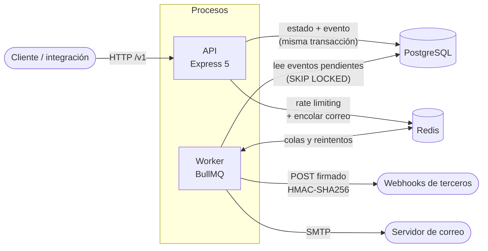

# tasks-platform

[](https://github.com/nachoLuarca/tasks-platform/actions/workflows/ci.yml)

API REST multi-tenant de gestión de tareas. Cada organización tiene sus
usuarios, roles con permisos granulares, proyectos y tareas, y puede
integrarse con otros sistemas mediante API keys y webhooks firmados.

Es un proyecto de portafolio: el foco está en la API (modelado, seguridad,
concurrencia y entrega confiable de eventos), no en una interfaz.

**Demo:** [tasks-platform-api.onrender.com/docs](https://tasks-platform-api.onrender.com/docs)
(Swagger UI con todos los endpoints). Corre en el plan gratuito de Render, que
duerme el servicio tras 15 minutos sin tráfico: **la primera petición puede
tardar hasta un minuto en responder** mientras despierta. Después va con normalidad.

## Features

- **Autenticación.** Registro, login, access token JWT (15 min) y refresh token
  rotativo con detección de reuso, cierre de sesión (una o todas), verificación
  de correo y recuperación de contraseña. Contraseñas con Argon2id.
- **Roles y permisos.** `OWNER`, `ADMIN`, `MEMBER` y `VIEWER` sobre una matriz
  de permisos explícita (`task:update:own`, `project:create`, ...). Gestión de
  miembros, invitaciones por correo y transferencia de propiedad.
- **Proyectos y tareas.** Proyectos con `key` única por organización (`ENG`),
  tareas numeradas por proyecto, estado, prioridad, fecha límite y asignación.
  Listados con paginación por cursor, filtros y orden. Borrado lógico.
- **Comentarios.** Sobre cada tarea; solo el autor puede editar el suyo.
- **Etiquetas.** Catálogo por organización, asignables a las tareas.
- **Bitácora.** Registro de solo lectura de cada cambio de una tarea
  (creación, estado, prioridad, responsable, fecha, título, etiquetas,
  comentarios).
- **Webhooks.** Cada entrada de la bitácora se publica como evento saliente a
  los webhooks suscritos: firmado con HMAC-SHA256, hasta 5 reintentos con
  backoff exponencial, historial de entregas, rotación de secreto, evento de
  prueba y desactivación automática tras fallos consecutivos.
- **API keys.** Claves por organización (`tp_live_...`) con scopes acotados;
  se guarda solo el hash y la clave completa se muestra una única vez. Una
  clave nunca puede tener más permisos que quien la creó.
- **Worker.** Proceso aparte que despacha los eventos pendientes, entrega los
  webhooks y envía el correo.
- **Correo.** Invitaciones, verificación de correo y recuperación de
  contraseña, enviados por SMTP desde el worker (Mailpit en local).
- **Operación.** Documentación OpenAPI 3.1 generada desde el código, errores en
  formato `application/problem+json`, `X-Request-Id` por petición, logs
  estructurados, rate limiting y endpoints `/health/live` y `/health/ready`.

## Arquitectura



El monorepo (pnpm workspaces) tiene dos aplicaciones y dos paquetes:

| Ruta                 | Contenido                                                                          |
| -------------------- | ---------------------------------------------------------------------------------- |
| `apps/api`           | API HTTP. Un módulo por dominio con `routes → controller → service → repository`   |
| `apps/worker`        | Despachador del outbox y consumidores de las colas (webhooks, correo)              |
| `packages/contracts` | Esquemas Zod: única fuente de verdad de validación y de OpenAPI                    |
| `packages/shared`    | Config, clientes de Prisma/Redis, colas y firma de webhooks, usados por ambas apps |

Cada capa solo habla con la siguiente: las rutas validan con los contratos, los
controllers traducen HTTP, los servicios concentran la lógica y los
repositorios son lo único que toca Prisma. Detalle en
[`ARCHITECTURE.md`](./ARCHITECTURE.md).

## Stack y decisiones técnicas

El stack es Node.js 24, TypeScript estricto, Express 5, PostgreSQL 17 (Prisma),
Redis 7 con BullMQ, Zod, Pino, Vitest + Supertest y Docker. Las decisiones
importantes tienen su ADR en [`docs/adr`](./docs/adr):

| Decisión                                                                                                       | Por qué                                                                                                            |
| -------------------------------------------------------------------------------------------------------------- | ------------------------------------------------------------------------------------------------------------------ |
| Monolito modular y monorepo ([0001](./docs/adr/0001-modular-monolith.md), [0002](./docs/adr/0002-monorepo.md)) | No hay necesidad de escalar partes por separado; los módulos quedan aislados por si algún día hay que extraer uno  |
| Contratos Zod compartidos y OpenAPI generado ([0012](./docs/adr/0012-generated-openapi.md))                    | Un solo esquema valida las peticiones y produce la documentación; CI falla si una ruta queda sin documentar        |
| Refresh token rotativo con detección de reuso ([0003](./docs/adr/0003-refresh-token-rotation.md))              | Un refresh token robado deja de servir y el reuso se detecta                                                       |
| Argon2id ([0004](./docs/adr/0004-password-hashing.md))                                                         | Hash de contraseñas resistente a GPU, con costos configurables                                                     |
| Matriz de permisos en código ([0005](./docs/adr/0005-permission-matrix.md))                                    | Un permiso mal escrito es un error de compilación, y la matriz se revisa en un solo archivo                        |
| Paginación por cursor ([0006](./docs/adr/0006-cursor-pagination.md))                                           | Rendimiento estable en listados grandes y sin filas repetidas o saltadas cuando hay escrituras concurrentes        |
| Bloqueo optimista con `version` ([0007](./docs/adr/0007-optimistic-locking.md))                                | Dos personas editando la misma tarea no se pisan en silencio: la segunda recibe `409`                              |
| Bitácora y outbox + cola ([0008](./docs/adr/0008-activity-log.md), [0009](./docs/adr/0009-outbox-pattern.md))  | El evento se guarda en la misma transacción que el cambio y el worker lo entrega después, sin bloquear la petición |
| Webhooks firmados ([0010](./docs/adr/0010-webhook-signing.md))                                                 | El receptor verifica origen e integridad; el timestamp firmado impide reenviar una entrega capturada               |
| Despliegue en Render + Neon + Upstash ([0013](./docs/adr/0013-render-deployment.md))                           | Costo cero indefinido; por eso la demo tarda en despertar                                                          |

Los tests (API y worker) corren contra PostgreSQL, Redis y Mailpit reales, no
contra mocks, y CI los ejecuta junto con lint, typecheck y la validación del
documento OpenAPI.

## Cómo correrlo en local

Requisitos: [Docker](https://www.docker.com/) con Compose v2. Node.js 24 (ver
[`.nvmrc`](./.nvmrc)) y [pnpm](https://pnpm.io/) solo si quieres correr lint,
typecheck o tests fuera de Docker.

```bash
git clone https://github.com/nachoLuarca/tasks-platform.git && cd tasks-platform
cp .env.example .env
docker compose up
```

Levanta la API (`http://localhost:3000`), el worker (`http://localhost:3100`,
solo expone `/health`), PostgreSQL, Redis y Mailpit (bandeja de correo local en
`http://localhost:8025`). Ambos procesos recargan en caliente.

La primera vez, y cada vez que cambie el esquema de Prisma, aplica las
migraciones:

```bash
pnpm install
pnpm db:migrate
```

Después abre <http://localhost:3000/docs> y comprueba la salud con
`curl http://localhost:3000/health/ready`.

Comandos útiles: `pnpm test`, `pnpm lint`, `pnpm typecheck`. Para correr los
tests en un entorno sin Docker, ver [`docs/cloud-setup.md`](./docs/cloud-setup.md).

## Más documentación

- [`ARCHITECTURE.md`](./ARCHITECTURE.md): arquitectura, capas y convenciones.
- [`docs/adr`](./docs/adr): decisiones de arquitectura, una por archivo.
- [`PHASE.md`](./PHASE.md): alcance de la fase actual.
- [`CONTRIBUTING.md`](./CONTRIBUTING.md) y [`CHANGELOG.md`](./CHANGELOG.md).
